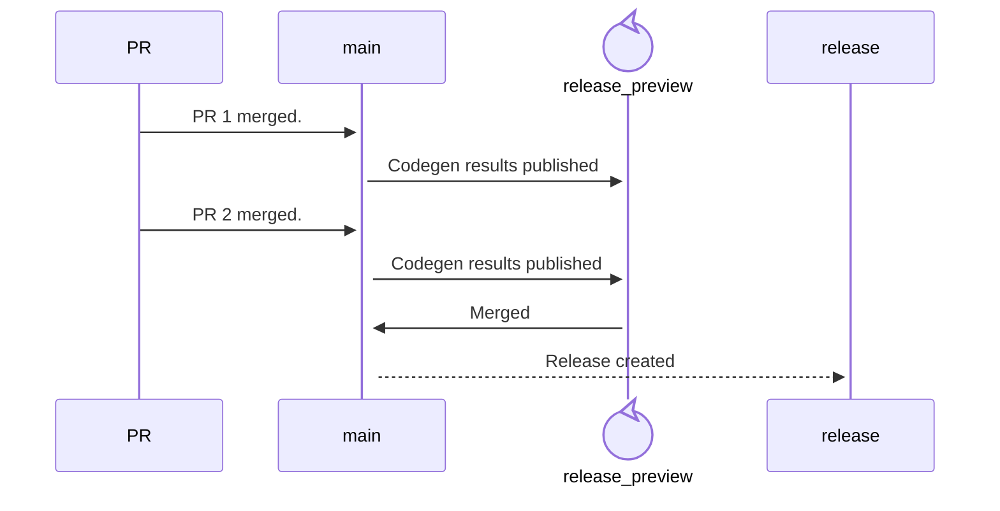

# Releasing

Releases to [`promql-builder`](https://github.com/grafana/promql-builder/)
are automated using a [few bash scripts](../scripts/) and [GitHub Actions](../.github/workflows/):

* `.github/workflows/release.yaml` is responsible for preparing and performing releases
* `.github/workflows/docs.yaml` builds and publishes the documentation

## The release process

Releasing a new version is an automated process and follows these steps:

1. push commits to `main` (ie: merge PRs to main)
    * `.github/workflows/release.yaml` starts, and calls the [`scripts/prepare-release.sh`](../scripts/prepare-release.sh) script
    * this script runs the codegen pipeline, and publishes the results in a `release-preview` branch for which a PR is opened with the title "Next release"
1. repeat step 1 until a new release is required
1. merge the "Next release" PR
    * `.github/workflows/release.yaml` starts, and calls the [`scripts/release.sh`](../scripts/release.sh) script
    * a tag is published
1. the documentation publishing workflow starts automatically whenever a tag is pushed

> [!NOTE]
> The `./scripts/prepare-release.sh` and `./scripts/release.sh` scripts are
> also usable locally.

